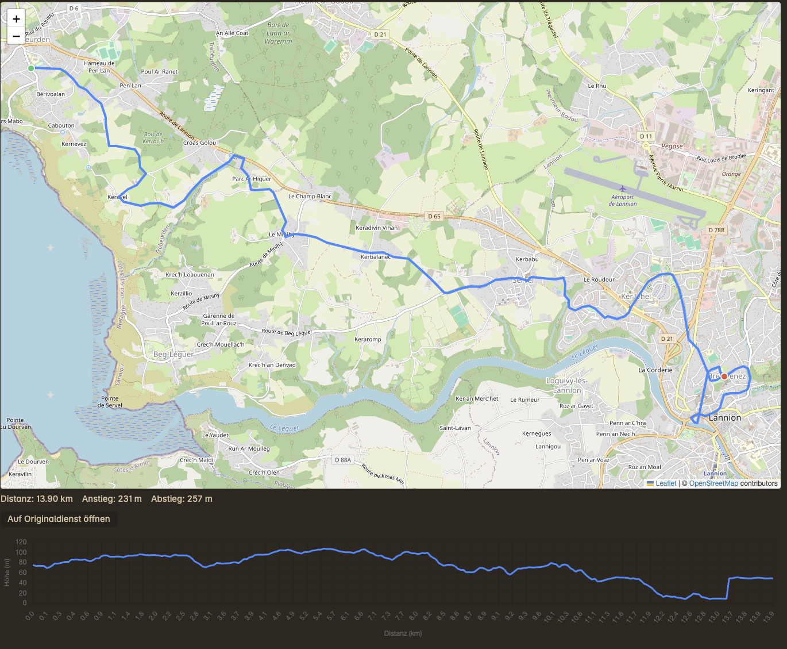
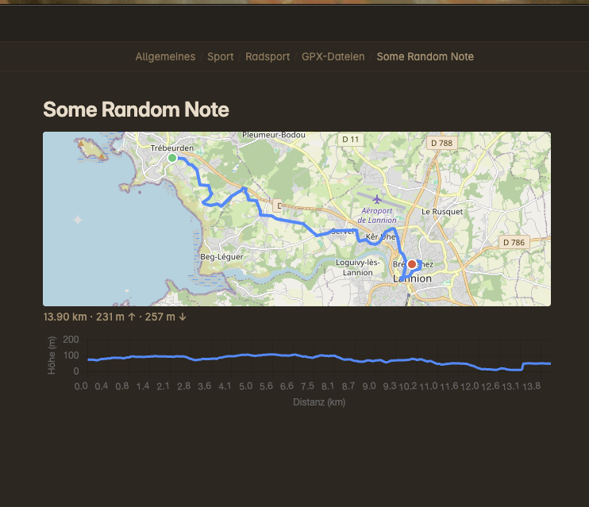

# GPX Viewer

An [Obsidian](https://obsidian.md) plugin that shows your `.gpx` track files — hikes, runs, bike tours — as an interactive map right inside your vault, with distance/elevation stats and a height profile.

Click a `.gpx` file to see the full view:



Or embed it in a note and see a compact preview:



## Features

- Opens `.gpx` files directly — click one in the file explorer and get a map, no separate app needed.
- Embed a track in any note with `![[track.gpx]]` and get a compact map + stats (Reading Mode only).
- Shows distance, elevation gain/loss, and a height profile chart.
- "Open on original service" button if the GPX file links back to where it came from (e.g. Garmin, Komoot, Strava).
- Configurable map tiles, units (metric/imperial), and whether the elevation chart is shown.
- Works on desktop and mobile.

## Installing

This plugin isn't on the community plugin list yet, so install it manually — either from a prebuilt release or by building it yourself.

### Option A: Download a release

1. Download `main.js`, `manifest.json`, and `styles.css` from the latest [release](../../releases).
2. Copy them into `<YourVault>/.obsidian/plugins/gpx-viewer/`.
3. In Obsidian, go to **Settings → Community plugins** and enable **GPX Viewer**.

### Option B: Build it yourself

Requires Node.js 18+ and npm.

1. Clone this repo (or download the source) into `<YourVault>/.obsidian/plugins/gpx-viewer/`.
2. Inside that folder, run:
   ```bash
   npm install
   npm run build
   ```
   This produces `main.js` next to the existing `manifest.json` and `styles.css` — no separate copy step needed, since the repo already lives in the plugins folder.
3. In Obsidian, go to **Settings → Community plugins**, click the reload icon (or restart Obsidian) so it picks up the new plugin folder, and enable **GPX Viewer**.

See [Developer guide](#developer-guide) below for `npm run dev` (watch mode) if you plan on changing the code.

## User guide

### Viewing a track

Click any `.gpx` file in your vault. It opens in a full-page view with:

- an interactive map (pan/zoom, start marker, end marker, and any waypoints from the file)
- a stats line: distance, elevation gain, elevation loss
- an elevation profile chart below the map
- an **"Auf Originaldienst öffnen"** ("Open on original service") button, if the file's metadata contains a link back to the service it was exported from

Try it with the example file in this repo: `public/Trebeurden_Lannion_parcours13.2RE.gpx`.

### Embedding a track in a note

Type `![[filename.gpx]]` in a note, e.g.:

```
![[Trebeurden_Lannion_parcours13.2RE.gpx]]
```

This shows a smaller version of the map plus a short stats line (and the elevation chart, if enabled). Two things to know:

- **Reading Mode only.** Switch out of Live Preview/editing mode (the book icon) to see the embed — it isn't rendered while editing.
- If you put an embed inside a **table**, give the column enough width — a very narrow column will force the map to grow past it rather than squish it unreadably small.

### Settings

Under **Settings → Community plugins → GPX Viewer** you can configure:

| Setting | What it does | Default |
|---|---|---|
| Tile-URL-Vorlage | The map tile source URL template | OpenStreetMap |
| Kartenattribution | Attribution text shown on the map | OpenStreetMap contributors |
| Einheiten | Metric (km, m) or imperial (mi, ft) | Metric |
| Höhenprofil anzeigen | Show/hide the elevation chart in both the full view and embeds | On |

### What this plugin doesn't do

By design, to keep it simple and predictable:

- No multi-track rendering — multiple `<trkseg>` segments in one file are merged into a single continuous line.
- No editing/Live Preview support for embeds — Reading Mode only.
- No vault-wide overview or list of all your GPX files.
- No integration with external services (Komoot, Strava, etc.) beyond reading the `<link>` tag already in the file — it never calls out to the internet on your behalf.
- No "open with default app" / OS file association (for mobile compatibility).

## Developer guide

### Project structure

```
gpx-viewer/
├── manifest.json
├── package.json
├── esbuild.config.mjs
├── vitest.config.mts
├── styles.css
└── src/
    ├── main.ts                    # plugin entry point (lifecycle only)
    ├── settings.ts                 # settings interface, defaults, settings tab
    ├── gpx/
    │   ├── models.ts               # TrackPoint / Waypoint / GpxData
    │   ├── parser.ts               # GPX XML → GpxData
    │   ├── stats.ts                # distance / elevation calculations
    │   └── units.ts                # metric ↔ imperial formatting
    ├── views/
    │   ├── GpxFileView.ts          # full-page view for .gpx files
    │   ├── MapRenderer.ts          # Leaflet map (only module that knows Leaflet)
    │   ├── ElevationChart.ts       # Chart.js elevation profile
    │   └── mapDefaults.ts          # default tile URL/attribution
    ├── embed/
    │   └── gpxEmbedProcessor.ts    # Reading Mode embed (![[file.gpx]])
    ├── cache/
    │   └── gpxFileCache.ts         # in-memory parse cache, keyed by path+mtime
    └── external/
        └── sourceLink.ts           # reads the sourceLink already parsed from the file
```

### Setup

Requires Node.js 18+ and npm.

```bash
npm install
npm run dev      # watch mode, rebuilds main.js on change
```

For local testing, this repo can live directly inside a vault's `.obsidian/plugins/gpx-viewer/` folder — `npm run dev` then rebuilds `main.js` in place, and reloading Obsidian (or using a hot-reload plugin) picks up the change.

### Building

```bash
npm run build     # type-checks, then produces a minified main.js
```

### Testing

```bash
npm test          # runs the Vitest suite (gpx/, cache/, external/ have unit tests)
```

Unit tests cover the pure logic (`gpx/parser.ts`, `gpx/stats.ts`, `gpx/units.ts`, `cache/gpxFileCache.ts`, `external/sourceLink.ts`) using jsdom, since those don't need a live Obsidian instance. `MapRenderer` and `ElevationChart` are verified manually against Obsidian instead, since they wrap Leaflet/Chart.js rendering.

### Architecture notes

- **`MapRenderer` fully encapsulates Leaflet.** No other module imports `leaflet` directly. It's constructed with `{ container, data, compact, tileUrl, attribution }` and used identically for both the full view and the compact embed — `compact` just toggles controls and a CSS size class.
- **The GPX parser throws on invalid input** (bad XML, no track/route points) rather than silently returning empty data — callers (`GpxFileView`, the embed processor) decide how to show that error.
- **`GpxFileCache`** is a single in-memory `Map` on the plugin instance, keyed by `path + mtime`, shared between the full view and the embed processor so re-rendering an embed while scrolling doesn't reparse the file.
- **Embeds are Reading-Mode-only** by design, implemented as a `registerMarkdownPostProcessor` that looks for `.internal-embed[src$=".gpx"]` elements Obsidian already creates for unrecognized file types, and replaces them. Each embed's Leaflet/Chart.js instances are torn down via a `MarkdownRenderChild` when the block is removed from the DOM (e.g. scrolled out or the note is re-rendered).
- **Leaflet's map sizing gotcha:** Leaflet reads its container's pixel size synchronously at creation time. In late-laid-out containers (e.g. a table cell), that can be wrong. `MapRenderer` defers the initial bounds-fit by one frame and attaches a `ResizeObserver` to keep correcting the size afterwards.

### Contributing

Keep changes scoped to what's described above — multi-track rendering, a vault-wide overview, Live Preview embed support, and third-party API integrations are intentionally out of scope (see "What this plugin doesn't do"). Bug fixes and small, focused improvements are welcome.

## License

[MIT](LICENSE)
